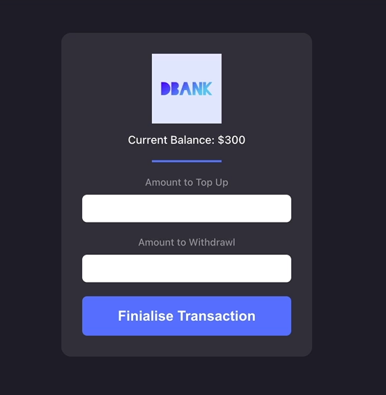

# DBANK → Defi (Decentralized Finance) DApp

DBANK project is inspired by compound protocol which is what’s called a money market protocol. (https://app.compound.finance/)

- Compound allows people to lend and borrow tokens
- For example:
    - People can supply their token and earn a little bit of interest on it
    - People can borrow token and bet that the tokens price will have gone down by the time they repay the token
- Compound will collect the interest paid by the borrowers and pay out that interest to the lender of that token while also taking a small fee for the service





If you want to start working on your project right away, you might want to try the following commands:

```bash
cd dbank/
dfx help
dfx config --help
```

## Running the project locally

If you want to test your project locally, you can use the following commands:

```bash
# Starts the replica, running in the background
dfx start --background

# Deploys your canisters to the replica and generates your candid interface
dfx deploy
```

Once the job completes, your application will be available at `http://localhost:8000?canisterId={asset_canister_id}`.

Additionally, if you are making frontend changes, you can start a development server with

```bash
npm start
```

Which will start a server at `http://localhost:8080`, proxying API requests to the replica at port 8000.

### Note on frontend environment variables

If you are hosting frontend code somewhere without using DFX, you may need to make one of the following adjustments to ensure your project does not fetch the root key in production:

- set `NODE_ENV` to `production` if you are using Webpack
- use your own preferred method to replace `process.env.NODE_ENV` in the autogenerated declarations
- Write your own `createActor` constructor

To learn more before you start working with dbank, see the following documentation available online:

- [Quick Start](https://sdk.dfinity.org/docs/quickstart/quickstart-intro.html)
- [SDK Developer Tools](https://sdk.dfinity.org/docs/developers-guide/sdk-guide.html)
- [Motoko Programming Language Guide](https://sdk.dfinity.org/docs/language-guide/motoko.html)
- [Motoko Language Quick Reference](https://sdk.dfinity.org/docs/language-guide/language-manual.html)
- [JavaScript API Reference](https://erxue-5aaaa-aaaab-qaagq-cai.raw.ic0.app)